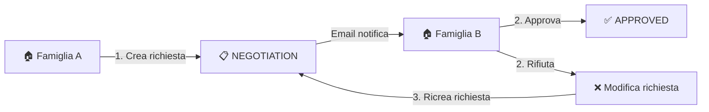

# 🏖️ PrenoPinzo

**Sistema di gestione prenotazioni per casa vacanze condivisa tra due famiglie**

PrenoPinzo è un'applicazione web Django che permette a due famiglie di gestire la prenotazione della loro casa vacanze in modo equo e trasparente, con un sistema di approvazione reciproca.

---

## 📖 Come Funziona

### Il Workflow di Prenotazione

PrenoPinzo garantisce che entrambe le famiglie abbiano pari diritti: ogni prenotazione richiede l'approvazione dell'altra famiglia prima di essere confermata.



**Step by Step:**

1. **Crei una richiesta** → Scegli le date e inserisci un titolo (es. "Vacanze Estive")
2. **L'altra famiglia riceve notifica** → Via email con link diretto alla dashboard
3. **L'altra famiglia decide** → Può approvare ✅ o rifiutare ❌ con motivazione
4. **Prenotazione confermata** → Appare nel calendario come approvata!

### 🔄 Sistema di Deroga

Cos'è una Deroga? Una **richiesta di modifica** su una prenotazione già approvata dell'altra famiglia.

**Esempio pratico:**
> Famiglia Andrea ha prenotato 10-20 Agosto (approvata).
> Famiglia Fabrizio scopre di aver bisogno proprio di quelle date.
> → Fabrizio può cliccare "Richiedi Modifica" e proporre nuove date.
> → Andrea può accettare (e la sua prenotazione viene modificata) o rifiutare (e la prenotazione originale rimane).

### 🖱️ Drag & Drop con Approvazione Intelligente

Puoi trascinare le tue prenotazioni direttamente nel calendario. Il sistema applica una logica smart:

| Tipo di Modifica | Cosa Succede |
|------------------|--------------|
| **Riduci il periodo** (es. 10-20 → 12-18) | ✅ Auto-approvato, l'altra famiglia riceve solo notifica |
| **Estendi il periodo** (es. 10-20 → 8-22) | ⏳ Richiede nuova approvazione |

Questa logica evita che tu debba aspettare approvazione per modifiche che "non disturbano" l'altra famiglia.

---

## ✨ Funzionalità

### 📅 Calendario Interattivo
- **Vista mensile/settimanale** con colori per famiglia (Verde = Andrea, Blu = Fabrizio)
- **Drag & Drop** per spostare o ridimensionare le tue prenotazioni
- **Click rapido** su data per creare nuova prenotazione
- **Festività italiane** evidenziate automaticamente

### 📋 Dashboard
La dashboard è il centro di controllo, divisa in sezioni:

| Sezione | Colore | Descrizione |
|---------|--------|-------------|
| **Richieste di Deroga** | 🔴 Rosso | Richieste URGENTI di modifica sulle tue prenotazioni |
| **Richiedono Attenzione** | 🟠 Arancione | Richieste dell'altra famiglia da approvare/rifiutare |
| **Le Tue Richieste** | 🔵 Blu | Le tue prenotazioni in attesa o da correggere |
| **Prenotazioni Approvate** | 🟢 Verde | Tutte le prenotazioni confermate |

### 💬 Chat Real-Time
- **Messaggi istantanei** via WebSocket
- **Emoji picker** integrato 😀
- **Indicatore "sta scrivendo..."**
- **Stato online/offline**
- **Storico persistente** di tutti i messaggi

### 📧 Notifiche Email
Ricevi email automatiche per:
- ✅ Prenotazione approvata
- ❌ Prenotazione rifiutata (con motivazione)
- 📝 Nuova richiesta da approvare
- 🔄 Richiesta di deroga
- ✏️ Modifica che richiede riapprovazione

**Promemoria automatici:**
- Ogni 6 ore: controllo messaggi chat non letti
- Ogni Lunedì alle 08:00: riepilogo prenotazioni in attesa

### 📊 Statistiche e Report
- **Utilizzo totale** per famiglia (giorni occupati)
- **Grafico a torta** della ripartizione percentuale
- **Trend mensile** dei mesi più utilizzati
- **Export iCal** per sincronizzare con Google Calendar, Apple Calendar, Outlook

### 📱 PWA Mobile-First
- **Installabile** su iOS e Android
- **Layout responsive** ottimizzato per smartphone
- **Touch-friendly** con FAB e bottom sheet
- **Calendario compatto** per schermi piccoli

---

## 🚀 Quick Start

### Prerequisiti
- Python 3.12+
- Docker & Docker Compose (per produzione)
- Git

### Sviluppo Locale

```bash
# Clona il repository
git clone https://github.com/hal9ooo/PrenoPinzo2.git
cd PrenoPinzo2

# Crea un virtual environment
python -m venv venv
source venv/bin/activate  # Linux/Mac
venv\Scripts\activate     # Windows

# Installa dipendenze
pip install -r requirements.txt

# Crea database e migrazioni
python manage.py migrate

# Crea utenti di test (password generate automaticamente)
python manage.py setup_test_data

# Avvia server di sviluppo
python manage.py runserver
```

### Produzione con Docker

```bash
# Copia e configura variabili d'ambiente
cp .env.example .env
# Modifica .env con le tue credenziali

# Build e avvio
docker compose up -d --build

# Verifica che funzioni
curl http://localhost/health/
```

---

## ⚙️ Configurazione

### Variabili d'Ambiente

| Variabile | Descrizione | Default |
|-----------|-------------|---------|
| `SECRET_KEY` | Django secret key | **(obbligatorio)** |
| `DEBUG` | Modalità debug | `False` |
| `ALLOWED_HOSTS` | Host permessi (comma-separated) | `localhost` |
| `DATABASE_PATH` | Path al database SQLite | `/app/data/db.sqlite3` |
| `SENDGRID_API_KEY` | API key SendGrid per email | - |
| `FROM_EMAIL` | Email mittente | `noreply@prenopinzo.local` |
| `APP_BASE_URL` | URL base dell'app | `http://localhost` |
| `EMAIL_ANDREA` | Email famiglia Andrea | `andrea@example.com` |
| `EMAIL_FABRIZIO` | Email famiglia Fabrizio | `fabrizio@example.com` |

### Esempio .env

```env
# Genera una chiave sicura:
# python -c "import secrets; print(secrets.token_urlsafe(50))"
SECRET_KEY=your-super-secret-key-here

DEBUG=False
ALLOWED_HOSTS=prenopinzo.example.com,localhost
APP_BASE_URL=https://prenopinzo.example.com

# SendGrid (https://app.sendgrid.com/settings/api_keys)
SENDGRID_API_KEY=SG.xxxxx
FROM_EMAIL=PrenoPinzo <noreply@example.com>

# Email delle due famiglie
EMAIL_ANDREA=andrea@example.com
EMAIL_FABRIZIO=fabrizio@example.com
```

---

## 🛠️ Management Commands

```bash
# Reset completo database (ATTENZIONE: cancella tutto!)
python manage.py reset_database

# Crea solo utenti di test (non cancella dati)
python manage.py setup_test_data

# Controlla messaggi chat non letti e invia email
python manage.py check_unread_messages
```

---

## 📁 Struttura Progetto

```
PrenoPinzo2/
├── bookings/                    # App principale
│   ├── consumers.py             # WebSocket consumer per chat
│   ├── email_utils.py           # Utility invio email
│   ├── models.py                # Modelli: Booking, UserProfile, ChatMessage, Audit
│   ├── views.py                 # Views HTTP (dashboard, calendar, statistics)
│   ├── management/commands/     # Management commands
│   │   ├── reset_database.py
│   │   ├── setup_test_data.py
│   │   └── check_unread_messages.py
│   └── templates/               # Template HTML
│       └── bookings/
│           ├── dashboard.html
│           ├── calendar.html
│           ├── chat.html
│           ├── statistics.html
│           └── help.html
├── PrenoPinzo/                  # Configurazione Django
│   ├── settings.py              # Settings sviluppo
│   ├── settings_prod.py         # Settings produzione  
│   └── asgi.py                  # ASGI per WebSocket
├── docker-compose.yml
├── Dockerfile
├── entrypoint.sh
├── crontab                      # Cron jobs per promemoria
└── requirements.txt
```

---

## 🔧 Stack Tecnologico

| Componente | Tecnologia |
|------------|------------|
| **Backend** | Django 6.0, Python 3.12 |
| **WebSocket** | Django Channels + Daphne |
| **Frontend** | Bootstrap 5, FullCalendar, SweetAlert2, Emoji Picker |
| **Database** | SQLite (PostgreSQL-ready) |
| **Container** | Docker, Docker Compose |
| **Email** | SendGrid SMTP |
| **Festività** | `holidays` Python library |

---

## 📱 Installare come PWA

L'app è una Progressive Web App installabile:

| Piattaforma | Come Installare |
|-------------|-----------------|
| **iOS Safari** | Condividi → Aggiungi a Home |
| **Android Chrome** | Menu ⋮ → Installa App |
| **Desktop Chrome** | Icona installazione nella barra URL |

---

## 📄 Licenza

MIT License - Vedi [LICENSE](LICENSE) per dettagli.

---

## 🤝 Contributi

Pull request benvenute! Per modifiche importanti, apri prima un issue per discutere.

---

Creato con ❤️ per gestire le vacanze in famiglia senza stress!
